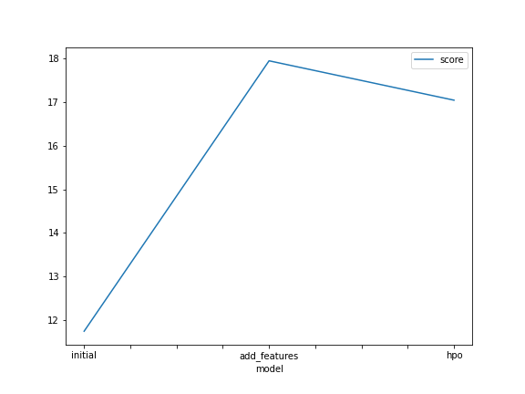
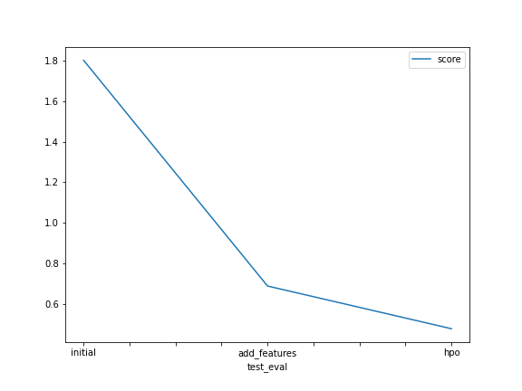

# Report: Predict Bike Sharing Demand with AutoGluon Solution
#### NAME HERE

## Initial Training
### What did you realize when you tried to submit your predictions? What changes were needed to the output of the predictor to submit your results?
I needed to set the predictions of the count value which were less than 0 to 0, because kaggle does not accept values less than one for this competition.

### What was the top ranked model that performed?
The  top model was the final one which had some hyperparameter tuning (using the multimodal parameter)

## Exploratory data analysis and feature creation
### What did the exploratory analysis find and how did you add additional features?
I found that there were mostly linear values and some categorical. To create the new feature I split the datetime into hours such that an hour column was added to the data and only the hour value was used from the datetime.

### How much better did your model preform after adding additional features and why do you think that is?
The model performed more than twice as well, I think because the hour feature was a very strong predictor of the count value.

## Hyper parameter tuning
### How much better did your model preform after trying different hyper parameters?
By a reasonable amount ~0.1

### If you were given more time with this dataset, where do you think you would spend more time?
I would especially try and find more features to better predict the value, and would also spend time time trying to optimize hyperparameters, although my expectation would be to get more out of the features due to the nature of how autogluon work - in that it does a lot under the hood and that hyperparameter tuning isn't 

### Create a table with the models you ran, the hyperparameters modified, and the kaggle score.
|model|hpo1|hpo2|hpo3|score|
|--|--|--|--|--|
|initial|Default vals|Default vals|Default vals|1.8
|add_features|Default vals|Default vals|Default vals|0.69
|hpo|multimodal|Default vals|Default vals|0.48

### Create a line plot showing the top model score for the three (or more) training runs during the project.

TODO: Replace the image below with your own.

### Create a line plot showing the top kaggle score for the three (or more) prediction submissions during the project.

TODO: Replace the image below with your own.

## Summary
The results improved after each iteration when testing against the test data. It showed a decrease in the model train score on the third iteration which suggests it was less prone to overfitting and was thus more acurate when tested against the test set. Overall, the third iteration was a significant improvement from the first iteration and achieved a higher than average score when compared against the leadboard.